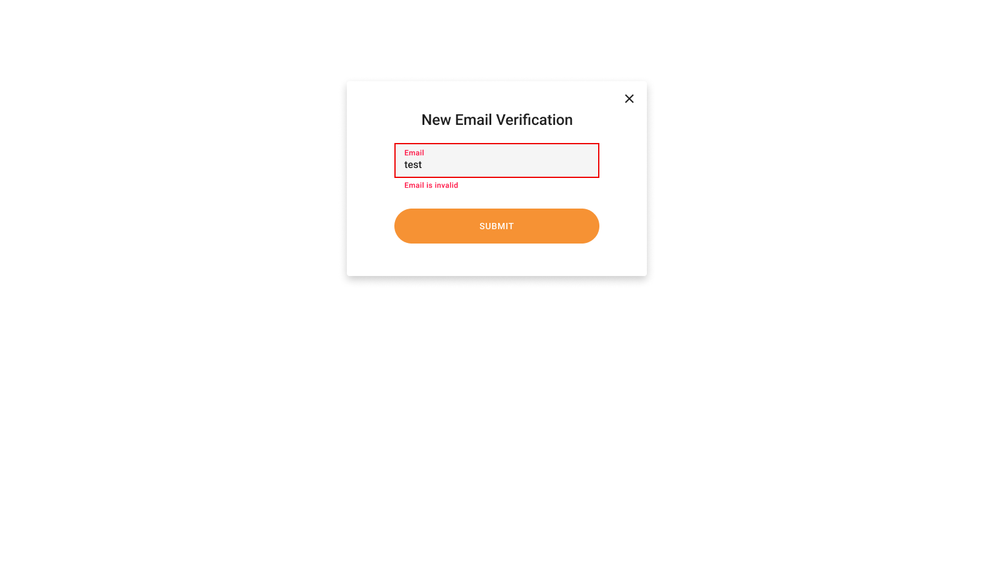
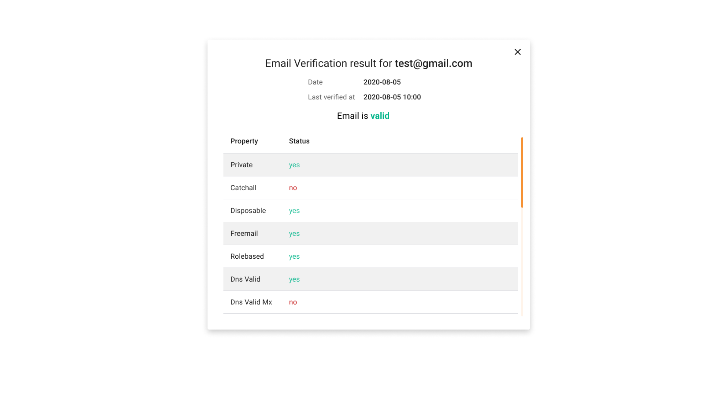
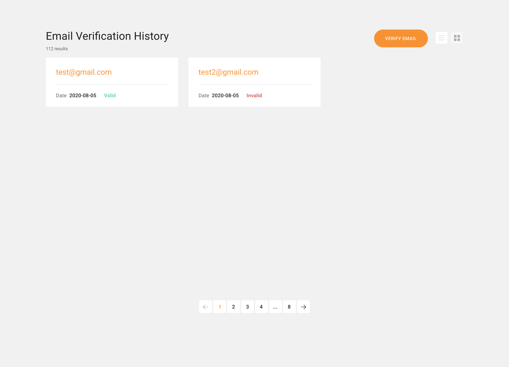
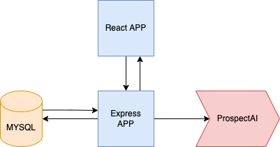

# Email Verification App

This repo only contains the backend part. Frontend is placed in another repository.

## App Features 

Verify new email

View email verification results

Browse through verification history

## How it works

Frontend is a React application. It communicates with backend API.

Backend provides two endpoints:
- GET `/emails` — returns an email verification history.
- POST `/verify` — verifies received email and saves results to database.

Verification logic is handled by external [ProspectAI API](https://api.prospectailabs.com/docs#/paths/~1api~1v1~1email-verifier/post).
